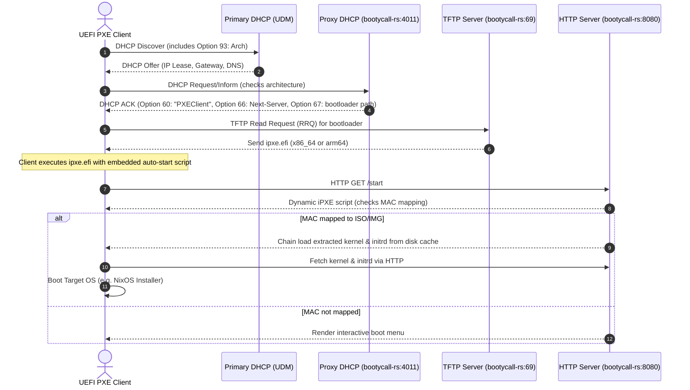

# 📞 BootyCall


`bootycall-rs` is a high-performance, single-binary, all-in-one network booting suite.

It serves as a modern replacement for the legacy setup of Caddy, TFTPd, and Shoelaces.

It hosts three core protocols (Proxy DHCP, TFTP, and HTTP) on a single asynchronous Tokio runtime, working alongside your existing primary DHCP server.

It was originally written to run on a _UniFi CloudKey Gen2 Plus_ so is built to be as lightweight as possible with a single goal, to _always answer the call_ to boot your servers.


---

## 🚀 Key Features

- **Proxy DHCP**: Intercepts client boot requests, parses client UEFI architecture (Option 93), and redirects them to the bootloader.
- **Asynchronous TFTP**: Serves customized or default bootloaders (`ipxe.efi`) with built-in block negotiation (`blksize`, `timeout`, `tsize`) and path traversal protection.
- **ISO & Disk Extraction**: Pure Rust extraction cache for kernels and ramdisks from ISOs or disk images (GPT/FAT), lowering idle memory footprint.
- **Dynamic iPXE Scripting**: Generates customized boot scripts per host MAC address, allowing infinite polling loops until assigned.
- **Dynamic Wallpapers**: Renders randomly selected wallpaper console backgrounds on client boot, supporting resolution matching.
- **Embedded UI**: Glassmorphic dark-mode web dashboard for real-time tracking of active host boots, events logging, and manual target assignments.

---

## 🏛️ Architecture & Flow



---

## 🛠️ Quick Start

### 1. Build and Run via Devenv

We use [devenv](https://devenv.sh) integrated with Nix flakes for our development workspace:

```bash
nix develop --impure

cargo run -p bootycall-rs -- --config bootycall.yaml
```

_The binary is automatically compiled and added to your shell path when entering the shell._

### 2. Run Tests

To run the complete workspace integration tests:

```bash
cargo test --all
```

---

## 📖 Further Documentation

- [Specification Guide](docs/spec.md) - Deep architectural and schema details.
- [Development Usage Guide](docs/usage.md) - How to setup directory trees, configure yaml, and bind privileged ports.
- [Operations Runbook](docs/operations.md) - Day-two operations: cache reset, GPIO/udev requirements, unit recovery, and logs.
- [Observability Guide](docs/observability.md) - Structured event schema and shipping boot activity into ClickHouse.
