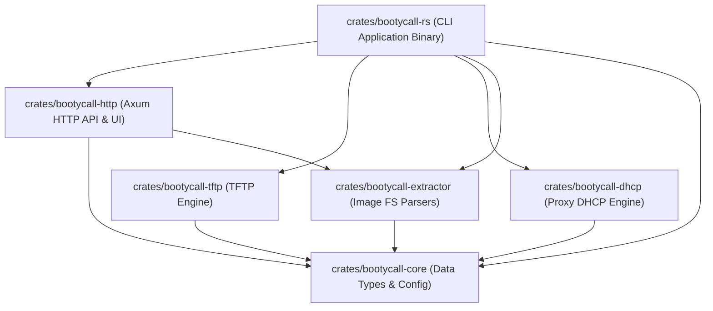

# Architecture Specification: bootycall-rs

This document outlines the internal component design, module interactions, port bindings, and data flows of the `bootycall-rs` server suite.

---

## 1. System Components & Port Bindings

The application runs as a single compiled binary executing multiple concurrent network listeners within a shared async `tokio` runtime.

```mermaid
graph TB
    subgraph LAN [Local Area Network]
        Client["UEFI Client Firmware"]
        UDM["UniFi Dream Machine (Primary DHCP)"]
    end

    subgraph Host ["Host OS (NixOS / CloudKey)"]
        subgraph BC [bootycall-rs Workspace]
            Core["bootycall-core (Shared Types, Config, State Store)"]
            Extractor["bootycall-extractor (ISO/IMG Parser)"]

            subgraph UDP [UDP Socket Bindings]
                DHCP["bootycall-dhcp (Proxy DHCP Server)<br/>Port: UDP 4011"]
                TFTP["bootycall-tftp (TFTP Server)<br/>Port: UDP 69"]
            end

            subgraph TCP [TCP Socket Bindings]
                HTTP["bootycall-http (Axum Server)<br/>Port: TCP 8080"]
            end
        end

        subgraph FS [Local Filesystem]
            ConfigYAML["bootycall.yaml"]
            TFTPRoot["TFTP Boot Folder<br/>(boot/x64/ipxe.efi, boot/arm64/ipxe.efi)"]
            ImagesDir["ISO / Disk Image Source Folder"]
            CacheDir["Persistent Disk Cache Folder<br/>(cache/&lt;MAC&gt;/kernel, cache/&lt;MAC&gt;/initrd)"]
            WallpaperDir["Wallpapers Folder<br/>(static/wallpapers/)"]
        end
    end

    %% Network flows
    Client -->|1. DHCP Discover| UDM
    UDM -.->|2. IP Lease| Client
    Client -->|3. DHCP Request / Inform| DHCP
    DHCP -->|4. PXE Redirection Offer (Option 60/66/67)| Client
    Client -->|5. Read Request (RRQ) for Bootloader| TFTP
    TFTP -.->|6. Sends ipxe.efi| Client
    Client -->|7. Bootstraps via HTTP GET /start| HTTP

    %% Internal Data & FS flows
    Core -.->|Loads & Watches| ConfigYAML
    Extractor -->|Scans & Reads| ImagesDir
    Extractor -->|Extracts Kernel / Initrd| CacheDir
    HTTP -->|Serves Cached Assets| CacheDir
    HTTP -->|Reads Wallpapers| WallpaperDir
    TFTP -->|Serves Bootloaders| TFTPRoot

    %% In-Memory State flows
    DHCP <-->|Reads target configuration| Core
    TFTP <-->|Checks per-MAC bootloader overrides| Core
    HTTP <-->|Polls state & records boot events| Core
    Extractor -.->|Invoked on config load/reload| Core
```

---

## 2. Component Design & Inter-Crate Dependencies

The system is separated into highly specialised workspace crates to ensure compilation efficiency, ease of testing, and modular replacement of components.



### Protocol and Internal Crate APIs

1. **`bootycall-core`**:
   - Exposes configuration parser `Config::load(path)` and directory watchers utilising the `notify` crate.
   - Manages a thread-safe `StateStore` wrapping an in-memory `HashMap` of host boot status mappings, shared across all asynchronous network loops using `Arc<RwLock>`.
2. **`bootycall-extractor`**:
   - Exposes `Extractor::sync_cache(config, state)` to parse, extract, and index bootloader files in user-space, avoiding loop device system mounts.
3. **`bootycall-dhcp`**:
   - Executes a Tokio UDP socket bind loop. Parses architecture configuration packets (DHCP Option 93) and responds with PXE options telling the client where to fetch the network boot loaders.
4. **`bootycall-tftp`**:
   - Implements an async TFTP parser serving files from the configured TFTP directory. Matches requested filenames against configured overrides in the state store.
5. **`bootycall-http`**:
   - Axum-based HTTP handler serving `/start`, `/poll/:mac`, `/dynamic/wallpaper.ipxe`, caching endpoints for kernel/initrd, and the embedded Web dashboard UI.
6. **`bootycall-rs`**:
   - Orchestrates service boot, coordinates graceful shutdown signals, and handles logging instrumentation (`tracing-subscriber`).
