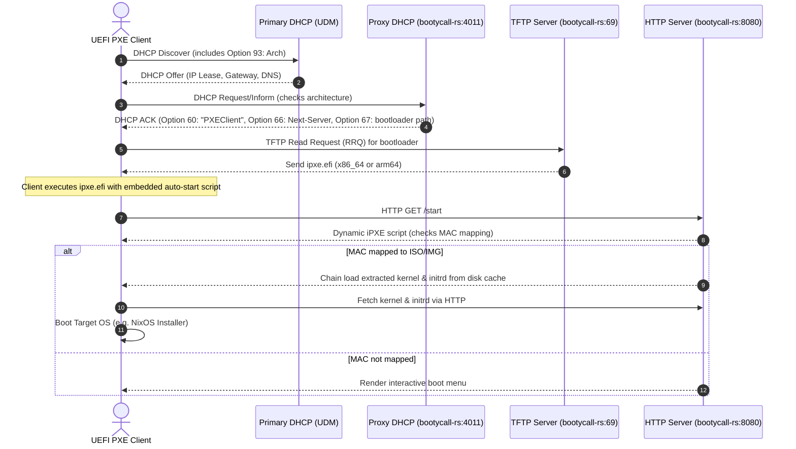

# Specification: bootycall-rs

`bootycall-rs` is a high-performance, single-binary, all-in-one network booting suite written in Rust. It serves as a modern replacement for the legacy setup of Caddy, TFTPd, and Shoelaces.

---

## 1. System Architecture & Flow

`bootycall-rs` hosts three core protocols (Proxy DHCP, TFTP, and HTTP) on a single asynchronous Tokio runtime, working alongside the existing primary DHCP server (e.g., UniFi UDM).



---

## 2. Cargo Workspace Crate Structure

The project is organized as a Cargo Workspace inside `bootycall-rs/` to guarantee modularity, clean unit testing, and separation of concerns.

```text
bootycall-rs/
├── Cargo.toml                      # Workspace definition
├── bootycall-core/                 # Shared types, logging, and config loading
│   ├── Cargo.toml
│   └── src/
│       ├── lib.rs
│       ├── config.rs               # YAML schema parser & watcher (notify crate)
│       └── state.rs                # Shared in-memory active host/events state
├── bootycall-dhcp/                 # Proxy DHCP Server logic
│   ├── Cargo.toml
│   └── src/
│       ├── lib.rs
│       └── server.rs               # UDP listener (ports 67/4011), parses Option 93
├── bootycall-tftp/                 # Async TFTP Server
│   ├── Cargo.toml
│   └── src/
│       ├── lib.rs
│       └── server.rs               # UDP listener (port 69), serves efi files
├── bootycall-extractor/            # ISO/IMG parser and file extractor
│   ├── Cargo.toml
│   └── src/
│       ├── lib.rs
│       └── parser.rs               # Pure Rust parser (ISO9660 & FAT32) to extract kernels/initrd
├── bootycall-http/                 # Axum web framework endpoints & UI
│   ├── Cargo.toml
│   └── src/
│       ├── lib.rs
│       ├── router.rs               # Endpoints for iPXE scripting and Web API
│       └── ui.rs                   # Embedded Web UI assets using rust-embed
└── bootycall-rs/                   # Main CLI binary wrapper
    ├── Cargo.toml
    └── src/
        └── main.rs                 # Initialises configuration, orchestrates tokio tasks
```

### Crate Responsibilities

- **`bootycall-core`**: Config structs, YAML loading, config live-reloading (via `notify`), and the global state tracking engine for currently active or polling machines.
- **`bootycall-dhcp`**: Listens on Port 67 (or Port 4011) to intercept DHCP requests, parses DHCP Option 93 (Client System Architecture Type), and replies with PXE options designating the proper bootloader filename.
- **`bootycall-tftp`**: Binds to Port 69 to serve the bootloader (`ipxe.efi` files) requested by the client UEFI firmware. Supports path overrides defined per-MAC address.
- **`bootycall-extractor`**: Accesses `.iso` or `.img` files in user-space using ISO9660 and GPT/FAT parsers, extracting kernel (`bzImage`/`vmlinuz`) and ramdisk (`initrd`/`initramfs`) files on the fly.
- **`bootycall-http`**: Axum web framework implementing:
  - Dynamic iPXE script output (the `/start` and `/poll` endpoints).
  - File streaming for extracted kernels/initrds.
  - The dynamic wallpaper selection endpoint.
  - Embedded vanilla HTML/CSS/JS dashboard.
- **`bootycall-rs`**: Command-line flag parsing, orchestration of tokio tasks, and systemd signal handling.

---

## 3. Configuration & YAML Schema

The configuration file `bootycall.yaml` maps MAC addresses to targets and configures service ports:

```yaml
server:
  http_bind: "0.0.0.0:8080"
  tftp_bind: "0.0.0.0:69"
  tftp_root: "./tftpboot"
  proxy_dhcp_bind: "0.0.0.0:4011"
  cache_dir: "./cache"
  default_bootloader_amd64: "boot/x64/ipxe.efi"
  default_bootloader_arm64: "boot/arm64/ipxe.efi"

hosts:
  - mac: "52:54:00:10:10:10"
    name: "nixos-amd64-installer"
    image_path: "/var/lib/bootycall/images/nixos-minimal-23.11-x86_64-linux.iso"
    bootloader: "boot/x64/ipxe-special.efi" # Optional bootloader override
    kernel_path: "boot/bzImage" # Optional internal ISO override
    initrd_path: "boot/initrd" # Optional internal ISO override
    cmdline: "init=/sbin/init console=ttyS0" # Custom boot arguments

  - mac: "aa:bb:cc:dd:ee:ff"
    name: "nixos-arm64-installer"
    image_path: "/var/lib/bootycall/images/nixos-minimal-23.11-aarch64-linux.iso"
```

---

## 4. Extraction & Caching Mechanics

To keep memory utilisation low on minimal hardware (e.g. CloudKey Gen2 Plus), `bootycall-rs` uses a **Persistent Disk Cache** workflow:

1. On startup or configuration reload, `bootycall-extractor` walks the YAML `hosts` list.
2. For each host, it inspects the `image_path` file metadata (modification time / SHA-256).
3. If the cache directory for that host does not exist or the image has been modified:
   - It reads the ISO/IMG using a user-space filesystem driver.
   - Looks for standard kernel names (`vmlinuz`, `bzImage`) and initrds (`initrd`, `initramfs`, `initrd.img`) in the filesystem tree, or respects YAML path overrides.
   - Extracts these files directly to `cache/<host_mac>/kernel` and `cache/<host_mac>/initrd`.
4. The HTTP server serves these files statically from `cache/<host_mac>/*`.

---

## 5. Dynamic Wallpaper Feature

To maintain rich custom console aesthetics, the iPXE boot menus support dynamic wallpaper rendering.

- **Storage**: Wallpapers are stored in a configured directory (e.g., `static/wallpapers/`).
- **Endpoint**: The HTTP server exposes `GET /dynamic/wallpaper.ipxe`.
- **Logic**:
  1. Reads the wallpapers folder.
  2. Filters for image formats (`.png`, `.jpg`).
  3. Picks a random image from the folder.
  4. Returns a dynamic iPXE script fragment:

     ```ipxe
     #!ipxe
     console --picture http://${next-server}:8080/static/wallpapers/selected_wallpaper.png --keep
     ```

  5. If the client requests specific resolutions or aspect ratios (e.g. via query params like `/dynamic/wallpaper.ipxe?width=1920&height=1080`), the picker can prioritize images inside matching resolution subdirectories (e.g., `static/wallpapers/1920x1080/`).

---

## 6. Target Hardware & Platform Requirements

- **Primary Target Architecture**: compiled and tested on `aarch64-unknown-linux-gnu` (NixOS on CloudKey Gen2 Plus) and `x86_64-unknown-linux-gnu`.
- **Resource Constraints**:
  - Target memory footprint: `< 30MB` RAM at idle.
  - User-space execution only (except binding privileged ports like 67/69, which is handled via systemd socket activation or Capabilities `CAP_NET_BIND_SERVICE`).
- **UEFI Mode Only**: Standard UEFI loaders only; legacy BIOS PXE (`undionly.kpxe`/`memdisk`) is not targeted.
